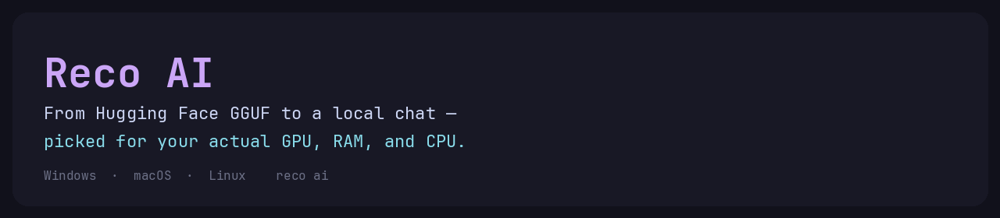
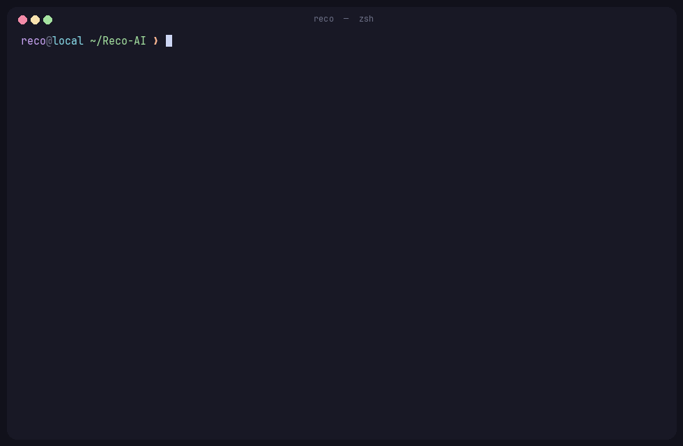
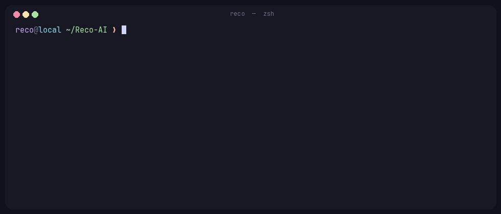
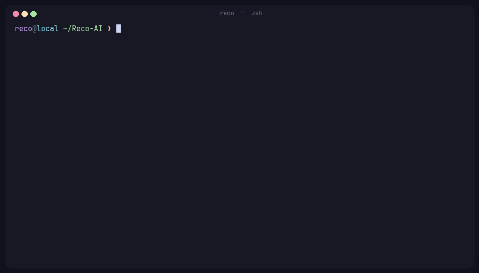
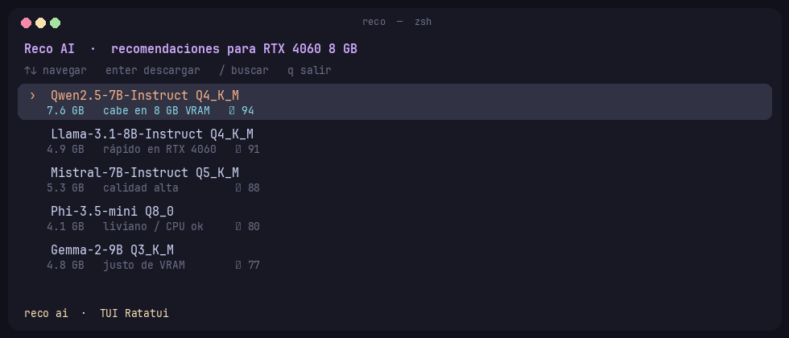
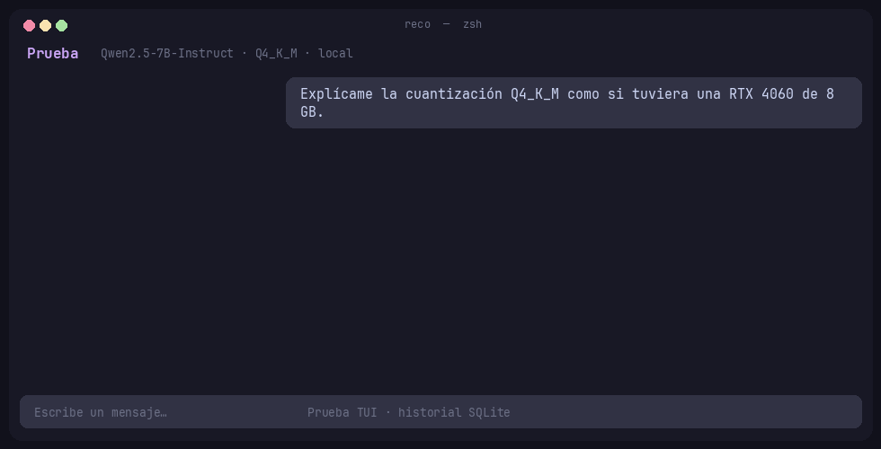
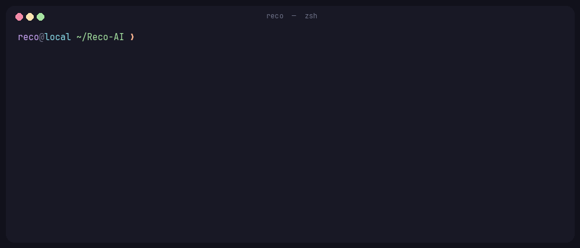

<p align="center">
  
</p>

<p align="center">
  <strong>Pick a local model that actually fits your machine — then chat with it.</strong><br />
  Hugging Face GGUF catalog + real hardware detection + one command.
</p>

<p align="center">
  
  
  
  
  
  
</p>

<p align="center">
  <a href="#quickstart">Quickstart</a> ·
  <a href="#commands">Commands</a> ·
  <a href="#why-not-just-ollama">Why Reco</a>
</p>

---

## Demo

`reco ai` reads your hardware, indexes GGUF repos from Hugging Face, ranks a quant that fits (40/20/20/20), and opens a catalog. Enter downloads the GGUF and opens the **Prueba** window (Tauri). Use `--tui` to stay in the terminal.

<p align="center">
  
</p>

`reco run` resolves the repo, picks the quant that fits, and shows the Hugging Face URL (add `--dry-run` to skip the download):

<p align="center">
  
</p>

Raw hardware profile:

<p align="center">
  
</p>

---

## Product

<table>
  <tr>
    <td align="center" width="33%">
      <br />
      <sub><b>Catálogo</b> — Ratatui, flechas + <code>/</code> buscar + panel de scores</sub>
    </td>
    <td align="center" width="33%">
      <br />
      <sub><b>Prueba</b> — ventana Tauri (catálogo + chat) · historial SQLite · TUI con <code>--tui</code></sub>
    </td>
    <td align="center" width="33%">
      <br />
      <sub><b>reco serve</b> — API OpenAI-compat, CORS, <code>stream</code>, clave persistente</sub>
    </td>
  </tr>
</table>

---

## Features

| | |
| --- | --- |
| **Hardware-aware picks** | CPU, RAM, NVIDIA (NVML / `nvidia-smi`), Linux DRM, Apple Metal. Score: 40% fit, 20% speed, 20% quality, 20% popularity. |
| **GGUF catalog** | Live Hugging Face index (`filter=gguf`), 12h cache, offline seed. |
| **One command** | `reco run` downloads the GGUF and opens the **Prueba** window. |
| **Prueba** | Tauri desktop chat (same SQLite as the CLI). Catalog + model switcher if you launch `reco desktop` with no args. `--tui` keeps the Ratatui chat. |
| **`reco serve`** | Local OpenAI-style API + generated `sk-reco-...` key. |
| **llama.cpp** | Real tokens via `llama-cli` on PATH (or `reco config set llama-cli`). |
| **BYOK** | Your OpenAI / Anthropic keys next to local GGUF (`reco config`). |

---

## Why not just Ollama?

| | Reco AI | Ollama | Hugging Face |
| --- | --- | --- | --- |
| Run a model locally | download + `llama-cli` (or BYOK) | excellent | DIY |
| Catalog size | HF GGUF index (top download slice) | curated subset | huge |
| “Will this fit my 8 GB 4060?” | measured hardware + 40/20/20/20 | you guess the tag | you guess the quant |
| Native chat + history | Prueba window + SQLite (TUI fallback) | separate apps | browser / spaces |
| Local OpenAI-style API | `reco serve` | yes | no |

Reco is the missing middle: **HF’s catalog, Ollama’s “just run it”, plus a real hardware check**.

---

## Quickstart

Requires [Rust](https://rustup.rs/) 1.83+.

```bash
curl -sSf https://raw.githubusercontent.com/DarioDGR12/Reco-AI/main/scripts/install.sh | bash
# or
cargo install --git https://github.com/DarioDGR12/Reco-AI --path crates/reco-cli
```

```bash
reco                         # estado de tu máquina y siguientes pasos
reco doctor                  # llama.cpp, claves, caché, ventana
reco desktop                 # ventana Prueba: catálogo + chat
reco ai                      # catálogo TUI · enter abre la ventana
reco run Qwen2.5-7B          # descarga + ventana Prueba
reco api create Qwen2.5-7B --name mi-app
reco api start               # esta máquina sirve las APIs
reco api code mi-app --client python
```

The desktop window is `reco-desktop` (Tauri). Build it with `scripts/build-desktop.sh` (needs WebKitGTK on Linux) and put the binary next to `reco` or on `PATH`. `reco run` / `reco chat` / `reco ai` open that window when it is present; `--tui` forces the terminal chat.

## Your machine is the server

`reco api create` generates a **named API**: unique key, OpenAI-compatible URL, and a client kit (Python, JS, curl, Continue, Cursor, Open WebUI, LangChain, OpenAPI, `.env`).

```bash
reco api create Llama-3.1-8B --name continue --lan
reco api start                 # hub: todas las claves en un puerto
reco api code continue --client continue
```

Another app only needs:

- **Base URL** `http://<esta-máquina>:11434/v1`
- **API key** `sk-reco-<nombre>-…` (scoped to that model)
- **Model** the Hugging Face repo id (or the API slug)

`--lan` binds `0.0.0.0` and prints the LAN IP so a phone or another PC can use it. Each key only unlocks its model. `reco api rotate <nombre>` issues a new key.

Kits land in `~/.config/reco/clients/<slug>/`.

Put `llama-cli` on `PATH` (or `reco config set llama-cli /ruta`) after installing [llama.cpp](https://github.com/ggml-org/llama.cpp). Cloud keys also read `OPENAI_API_KEY` / `ANTHROPIC_API_KEY`.

CLI copy is Spanish; crate names and this README are English.

---

## Commands

| | |
| --- | --- |
| `reco` | Home: hardware, motor, modelos en disco, chats recientes |
| `reco ai` | Ranked catalog (TUI). Enter opens the Prueba window |
| `reco desktop [modelo]` | Tauri window: catalog picker, or chat if you pass a model |
| `reco run <modelo>` | Download the GGUF that fits, then open the Prueba window |
| `reco chat <modelo>` | Reopen the last conversation (`--tui` = terminal) |
| `reco api` | Generate / list / start / code custom APIs for other apps |
| `reco serve` | Hub of all APIs, or `reco serve <modelo>` for one |
| `reco models` | List (or `rm`) cached GGUFs |
| `reco doctor` | llama-cli, BYOK, catalog cache |
| `reco config` | `show` / `set` / `get` / `unset` |
| `reco completions bash` | Shell completions (`zsh`, `fish`) |
| `reco hw` | Hardware profile |

`--provider auto|llama|openai|anthropic|echo` on run / chat / serve. Downloads resume if interrupted.

GPU detection never needs the CUDA toolkit. NVIDIA uses NVML or `nvidia-smi`. No GPU → CPU, no crash.

---

## Next

In-process llama.cpp, signed macOS / Windows installers. Linux packages: [packaging/README.md](packaging/README.md).

---

## Crates

```
crates/reco-core      hardware, GGUF types, scoring, chat store, InferEngine
crates/reco-catalog   Hugging Face client + cache + seed
crates/reco-cli       `reco` binary (clap + Ratatui)
crates/reco-desktop   Tauri app “Prueba” (not a workspace member; needs WebKitGTK)
                      build: scripts/build-desktop.sh

Linux packages: see [packaging/README.md](packaging/README.md).
```

Regenerate terminal GIFs with [VHS](https://github.com/charmbracelet/vhs) (`docs/vhs/*.tape`) or:

```bash
python3 docs/vhs/render_gifs.py
```

---

## License

[MIT](LICENSE)
